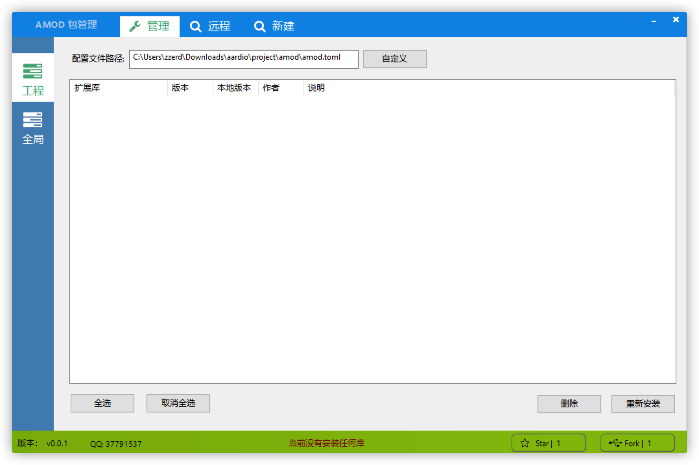
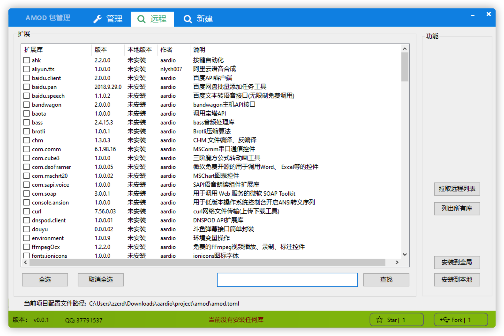
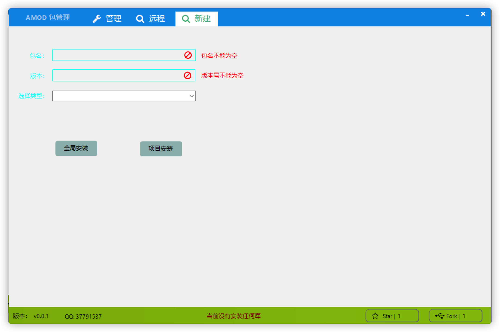

## amod 

> 这是一个 aardio 库和依赖管理的第三方插件。比原有的库管理工具更直观，且可以在 libs 分支里提交你自己的库（还未实现）。已实现更多安装式，可以方便的增加删除依赖库，其中库路径可为本地路径、git、url(lzmp格式下载地址)三种。库依赖用 [amod.toml](docs/库提交规范.md) 配置。全局配置文件在 %APPDATA%/amod/amod.toml


## 实现了什么功能

- [x] 库的基本安装与删除，集成了原来的库列表

- [x] 可选安装在工程 或者全局 lib 目录下

- [x] 可以安装 git url 本地路径的库

- [x] 库缓存本地目录，安装是通过 符号链接（目录） 硬链接（文件）进行安装的，无论装多少次和装一次是占用一样的硬盘。！要注意的是库是缓存在用户目录的，如果工程文件不是在用户目录的硬盘那么软链接会出现异常

- [x] 实现了一个增加一个库依赖的界面，不过我感觉还很简单，不如直接编辑amod.toml文件里的依赖部分来的直接，如果有人要重写一个我也是欢迎的 

  

### todo


- [ ] git clone 如果目标存在则必成git pull 或者统一改成git fetch 后对比版本再merge
- [ ] 写说明文档
- [ ] 双击库打开示例文件
- [ ] 缓存的库文件的路径应该加上版本以区分不同版本
- [ ] git clone 和 下载 url 应该新建一个lock文件写入版本，如果有lock file 下载应该下载或 clone 指定版本hash
- [ ] 递归下载依赖库里的依赖
- [ ] 为远程库建立库提交规范
- [ ] 为每个库函数建立单元测试文件 

## 使用方法

### 1、安装

使用方法为把本库 clone 到工具目录 OR 代码片段目录，如果你要 pr 也可以放在其它地方，在工具目录里建立一个符号连接如：cmd  `mklink /j ~/src/amod aardio/tools/amod` 。

如果你看不懂上面说什么那么你可以复制下面的代码进行安装：

```aardio
import inet.whttp
var str = inet.whttp().get("https://cdn.jsdelivr.net/gh/zzerding/amod@master/res/amod_install.aardio")
loadcodex(str)
```

如果你想要自动用 git 安装也是可以的复制如下代码进行安装：

```aardio
import inet.whttp
var str = inet.whttp().get("https://cdn.jsdelivr.net/gh/zzerding/amod@master/res/amod_install_git.aardio")
loadcodex(str)
```

### 2 、管理安装的库



如图所示, 库分为安装在全局aardio/lib 目录和当前工程目录，在左侧切换管理。安装好的库在这显示，你可以方便的进行删除。

### 3、 安装远程的库



这里拉取远程列表，拉取的仓库为https://cdn.jsdelivr.net/gh/zzerding/amod@release/libs.json.gz 和 http://api.aardio.com/v10/exlibs/?all 这两的列表缓存更新到本地仓库。

可以直接在查找栏目里输入关键字进行查询，安装到本地的意思就是安装到工程里的 lib 目录，所有库文件以符号链接的方式安装,原文件在 %APPDATA%/aardio/amod/cache 目录

### 3、更方便管理自已的库



如图所示，我们可以实验性的安装一些远程仓库中没有收录的库，以方便管理。可以以 http git  file 三种形式进行安装。http 就是库的压缩包下载链接（支持 lzma gz tgz 文件后缀）， git 就是仓库地址, file 就是包的目录或者文件。比如我们可以把代码段里的文件当成库导入到工程目录。

## 包的提交

包请提交到 libs 分支，提交[说明在这](https://github.com/zzerding/amod/tree/libs/)当然这要你学会用 git 。
